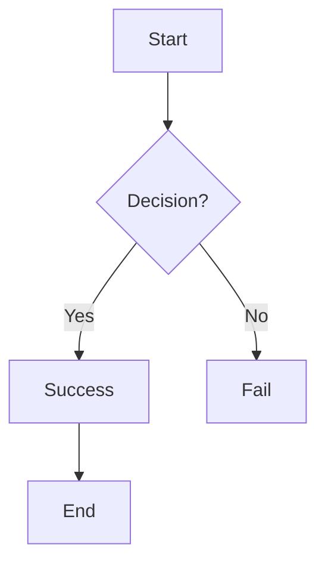

<!-- comment -->

<!-- comment
multi
lines -->

# Header 1 `inline code` _emphasis_ **strong**

## Header 2 with [link](https://vscode.dev) and <abbr title="GitHub Flavored Markdown">GFM</abbr>

### Header 3 ~~strikethrough~~ <mark>highlight</mark> ==underline== <u>u</u>

#### Header 4: `inline code` **bold + code** _italic + code_

##### Header 5 with subscript H<sub>2</sub>O and superscript X<sup>2</sup>

###### Header 6 smallest

> Blockquote with **bold**, _italic_, and `code`
>
> > Nested blockquote
>
> Trailing text

## Lists (unordered, ordered, task, definition)

- Unordered list item with `inline code`
  - Nested item ×2
    - Deep ×3
  - [ ] Task list (unchecked)
  - [x] Task list (checked)
- [Example link](https://example.com) **bold**
- Email: [dev@example.com](mailto:dev@example.com)
- Emoji: :rocket: :tada: 🚀 🎉
- Footnote reference[^1]

1. Ordered list
   1. Nested 1.1
   2. Nested 1.2
2. Second item with ~~strikethrough~~

[^1]: Footnote definition with [link](https://example.com)

## Tables

| Feature                    | Inline | Block | Status |
| -------------------------- | :----: | ----: | :----: |
| **Bold**                   | `yes`  | `yes` |   ✅   |
| ~~Strike~~                 | _yes_  | _yes_ |   ✅   |
| [Link](https://vscode.dev) |   ✓    |     ✓ |   ✅   |
| <mark>Highlight</mark>     |   ❌   |    ❌ |   ❌   |
| ~~Task~~ [ ] [x]           |   ❌   |    ✅ |   ✅   |

**Left/center/right/emphasis aligned table:**

| Left | Center | Right | **Header** |
| :--- | :----: | ----: | :--------- |
| a    |   b    |     c | mixed      |
| 1    |   2    |     3 | ~~strike~~ |

## Code blocks

**Fenced with syntax highlighting**

```python
def hello(name: str) -> str:
    return f"Hello {name=}"
```

**Multiple languages**

```typescript
// TypeScript
const x: string = "typed";
```

```yaml
# YAML anchors
defaults: &defaults { retries: 3 }
use: *defaults
```

## Inline elements

**Emphasis**: _italic_ _italic_ **bold** **bold** **_bold italic_** **_bold italic_**

~~Strikethrough~~ <del>del</del>

**Highlight**: <mark>marked</mark> ==highlight==

**Links**: [external](https://code.visualstudio.com) [local](#header-2) [ref][link-ref]

[link-ref]: https://github.com "Title"

**Images**:   


## Special formatting

**Escaped**: \*not italic\* \`not code\`

**HTML**: <details><summary>Toggle</summary>Hidden content</details>

**Task lists**:

- [ ] Not done
- [x] Done ✅
  - [ ] Nested undone
  - [x] Nested done

## Diagrams (Mermaid - VSCode extension)



## Math (requires extension)

**Inline**: $E=mc^2$ $x \in [0,1)$

**Block**:

$$
\int_0^\infty e^{-x^2} dx = \frac{\sqrt{\pi}}{2}
$$

## Emoji + Unicode

:sparkles: :trophy: :white_check_mark: ✨🏆✅

## Raw HTML + custom

<div class="custom-class">
  <span style="color: red">Custom HTML</span>
</div>

<script>console.log("raw JS")</script>

<style>.hidden { display: none; }</style>
